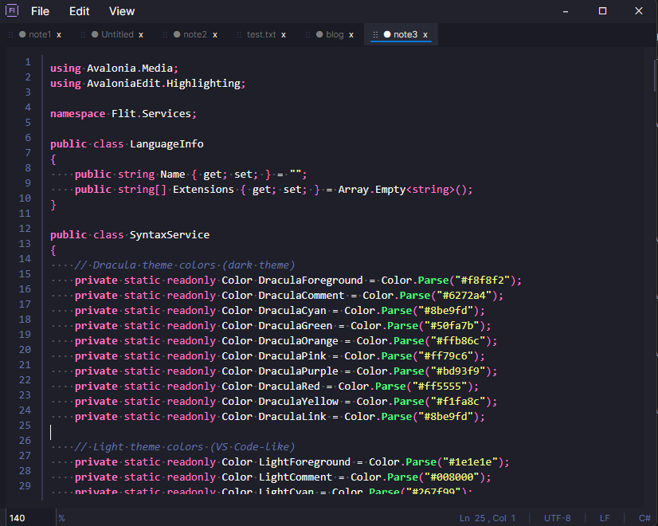

<p align="center">
  
</p>

<h1 align="center">NoteMode</h1>

<p align="center">
  A lightweight, fast desktop text editor built with C# and Avalonia UI.
</p>

## Features

- **Tabbed editing** with drag-and-drop reordering and smart tab selection
- **Syntax highlighting** for 20+ programming languages
- **Auto-save** with content caching (changes saved every 500ms)
- **Session persistence** - reopens your tabs, window state, and font preferences
- **Find & Replace** with regex support
- **Find in all tabs** - search across all open files
- **External file change detection** with reload prompts
- **Dual themes** - Dracula dark and VS Code-inspired light theme
- **Cross-platform** - Windows, macOS, Linux

## Screenshot



## Requirements

- [.NET 10.0 SDK](https://dotnet.microsoft.com/download)

## Building

```bash
cd src
dotnet build
```

## Running

```bash
cd src
dotnet run --project NoteMode
```

Or for a release build:

```bash
cd src
dotnet build -c Release
dotnet run --project NoteMode -c Release
```

## Keyboard Shortcuts

| Shortcut | Action |
|----------|--------|
| `Ctrl+N` | New tab |
| `Ctrl+O` | Open file |
| `Ctrl+S` | Save |
| `Ctrl+Shift+S` | Save As |
| `Ctrl+Shift+A` | Save All |
| `Ctrl+W` | Close tab |
| `Ctrl+F` | Find |
| `Ctrl+H` | Find & Replace |
| `Ctrl+Shift+F` | Find in all tabs |
| `Ctrl+Shift+W` | Toggle whitespace |
| `Ctrl+Scroll` | Adjust font size |

## Architecture

Built with MVVM pattern:

```
src/NoteMode/
├── Models/          # Data structures (AppState, TabState)
├── Services/        # Business logic (state, cache, syntax)
├── ViewModels/      # Presentation logic with bindings
├── Views/           # Avalonia XAML UI definitions
└── Themes/          # Color schemes (Dracula, Light)
```

## Data Storage

- App state: `~/.notemode/state.json`
- Tab cache: `~/.notemode/cache/`

## Tech Stack

- [Avalonia UI](https://avaloniaui.net/) - Cross-platform UI framework
- [AvaloniaEdit](https://github.com/AvaloniaUI/AvaloniaEdit) - Text editor component
- [ReactiveUI](https://www.reactiveui.net/) - Reactive MVVM extensions

## License

MIT
