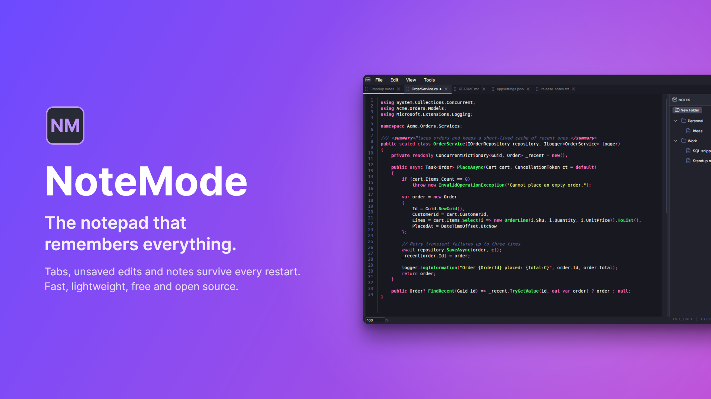
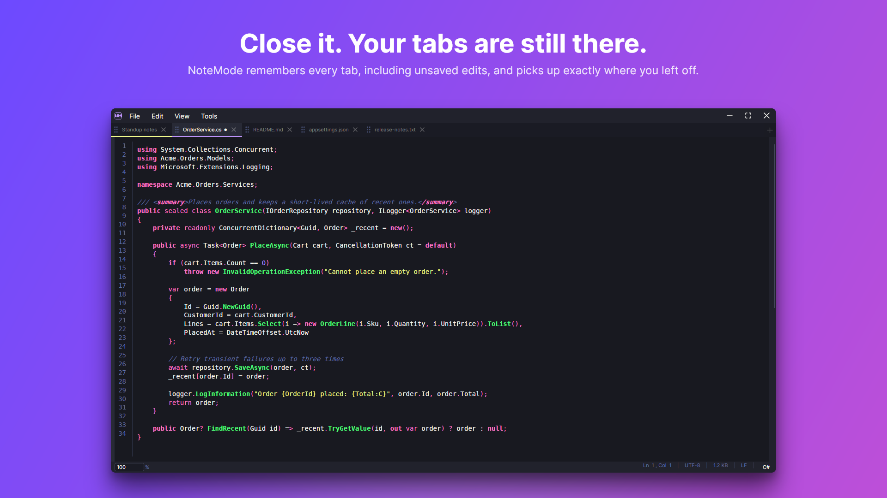
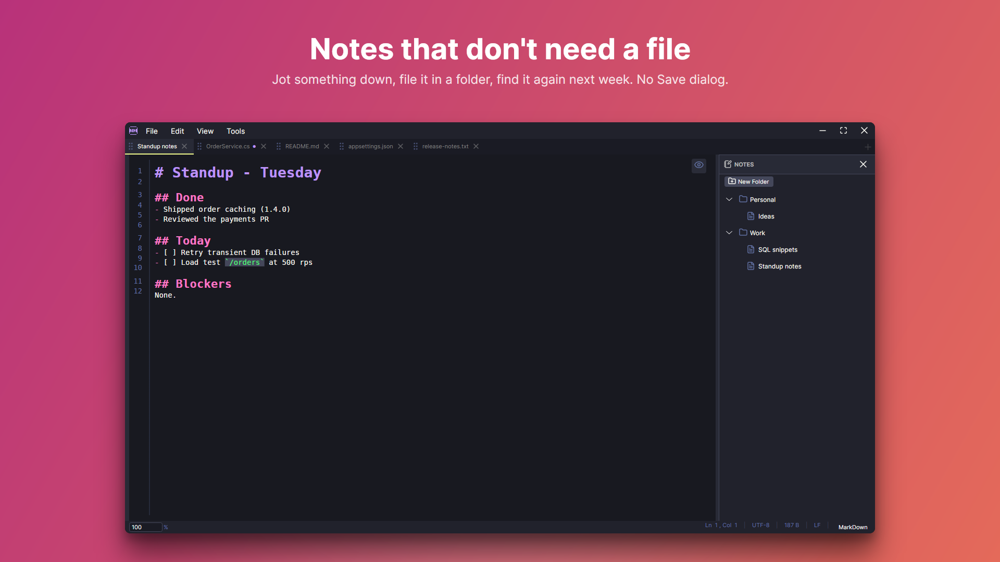
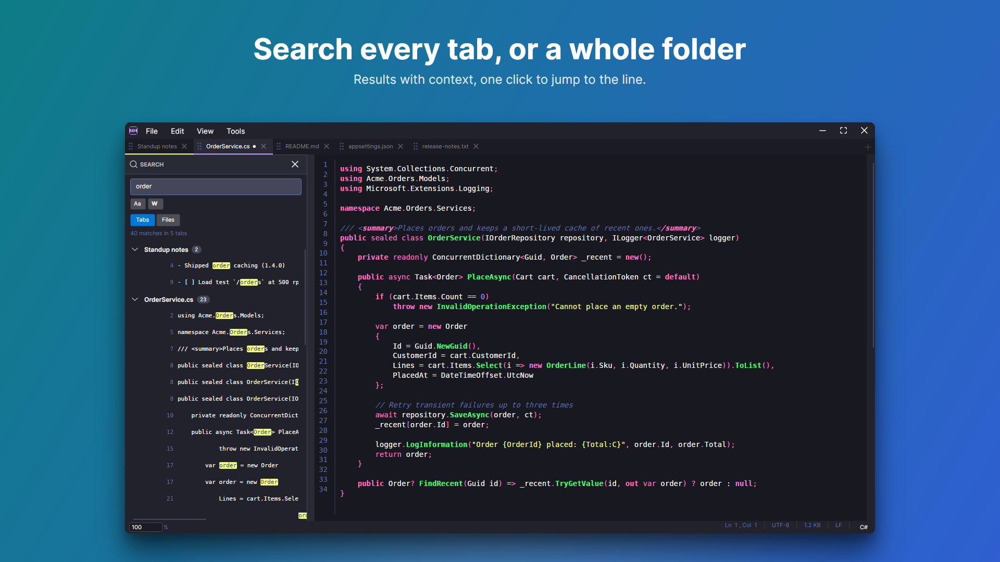
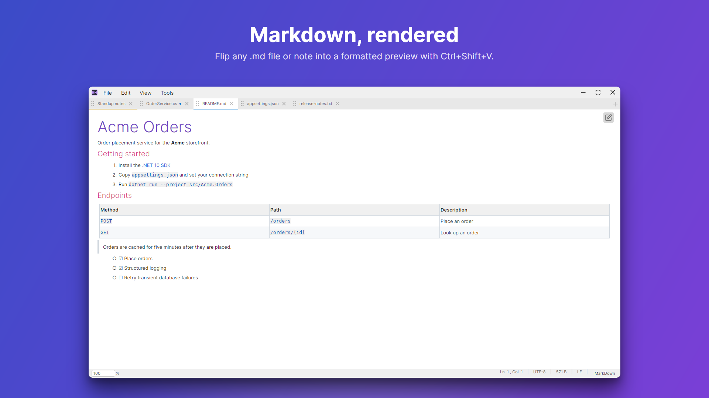
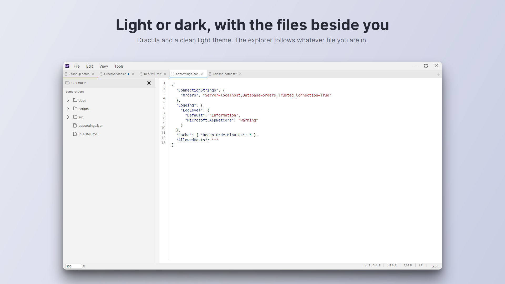

<p align="center">
  
</p>

# NoteMode

A lightweight, fast text editor that remembers your session. Close it, restart your PC, come back
next week: every tab is still open, including the ones you never saved. Free and open source, built
with C# and [Avalonia](https://avaloniaui.net/).

## Features

- **Session that survives everything** - tabs, unsaved edits, window size, theme and panels come back exactly as you left them. Edits are cached to disk as you type, so nothing asks you to save before you can shut down
- **Notes** - text that doesn't need a file: name it, organise it in folders, find it in the Notes panel (Ctrl+Shift+N)
- **Search** - across every open tab or a whole folder, with results in context (Ctrl+Shift+F); find and replace in the current file (Ctrl+F / Ctrl+H)
- **Syntax highlighting** for 30+ languages, picked from the file extension or chosen from the status bar
- **Markdown preview** - flip any `.md` file or note into a rendered view (Ctrl+Shift+V)
- **Explorer panel** - the folder of the file you are in, one click to open a neighbour (Ctrl+E)
- **External changes** - a file changed by another program reloads by itself, or asks first if you have edits
- **Keeps your encoding** - UTF-8 with or without BOM, UTF-16 and legacy ANSI files are saved the way they were opened
- **Safe saves** - a file is replaced only once the new version is fully written; if a save fails (read-only, locked) you are told and your edits stay open
- **Dracula dark and light themes**, whitespace and line numbers, Ctrl+scroll zoom, drag to reorder tabs
- **Single window** - opening a file from Explorer while NoteMode is running adds a tab instead of a second window
- **Explorer integration** - "Edit with NoteMode" on any file, and per-type file associations in Settings

## Screenshots



| | |
| --- | --- |
|  |  |
|  |  |

## Install

Windows 10/11 (x64). No .NET runtime needed. Download from the
[latest release](https://github.com/timothydodd/notemode/releases/latest):

| Download | What it is |
| --- | --- |
| `NoteMode-Setup-<ver>.exe` | **Recommended.** Installs NoteMode, adds it to the Start menu, "Open with" and (optional) the Explorer context menu. Upgrades an older MSI install in place. |
| `NoteMode-v<ver>-win-x64.zip` | Portable: unzip anywhere and run `NoteMode.exe`. |

`SHA256SUMS.txt` in each release lists the file hashes.

On macOS and Linux, build from source (below); NoteMode runs there too, without the installer.

## Keyboard shortcuts

| Shortcut | Action |
|----------|--------|
| `Ctrl+N` | New tab |
| `Ctrl+O` | Open file |
| `Ctrl+S` / `Ctrl+Shift+S` | Save / Save As |
| `Ctrl+Shift+A` | Save all |
| `Ctrl+W` | Close tab |
| `Ctrl+F` / `Ctrl+H` | Find / Find and replace |
| `Ctrl+Shift+F` | Search in tabs and files |
| `Ctrl+E` | Explorer panel |
| `Ctrl+Shift+N` | Notes panel |
| `Ctrl+Shift+V` | Markdown preview |
| `Ctrl+Shift+W` | Show whitespace |
| `Ctrl+Z` / `Ctrl+Y` | Undo / Redo |
| `Ctrl+Scroll` | Zoom (6-72 pt) |
| `Esc` | Close the focused panel |

## Where your data lives

Everything stays on your computer, in `~/.notemode` (`%USERPROFILE%\.notemode` on Windows):

- `state.json` - open tabs, window and panel settings
- `notes.json` - note titles and folders
- `cache/` - the text of notes and of unsaved edits

NoteMode makes no network connections ([privacy policy](docs/privacy.md)). Uninstalling leaves
`~/.notemode` in place so your notes are not lost.

## Building from source

```bash
git clone https://github.com/timothydodd/notemode.git
cd notemode
dotnet run --project src/NoteMode
```

Needs the [.NET 10 SDK](https://dotnet.microsoft.com/download). Installers, the Store package, code
signing, releases and the screenshot tool are covered in [docs/building.md](docs/building.md).

## Tech stack

- [Avalonia UI](https://avaloniaui.net/) - cross-platform UI framework
- [AvaloniaEdit](https://github.com/AvaloniaUI/AvaloniaEdit) - text editor component
- [Markdown.Avalonia](https://github.com/whistyun/Markdown.Avalonia) - Markdown preview
- Native AOT - a single native executable, fast to start

## License

[MIT](LICENSE). Issues and pull requests are welcome.
